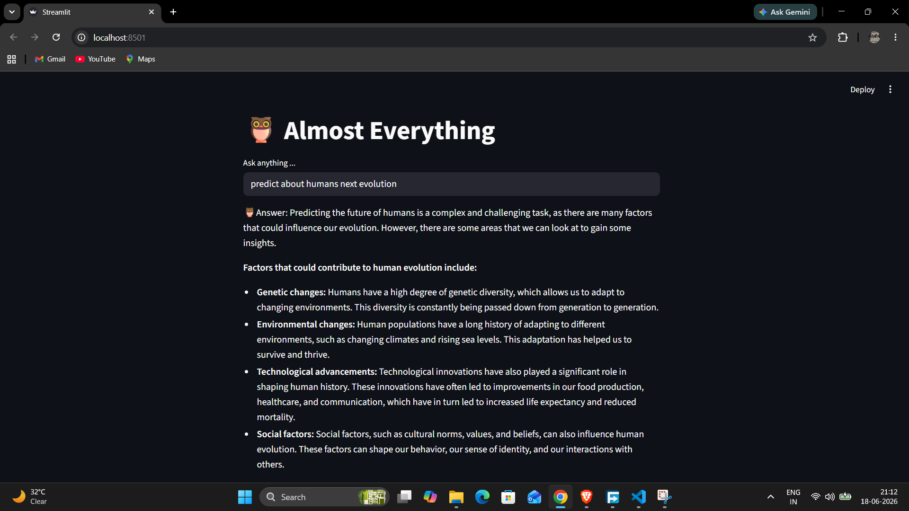

# 🦉 Almost Everything

An AI-powered chatbot built using Streamlit, LangChain, and Ollama.

## Features

* Interactive chatbot interface
* Real-time AI responses
* Prompt-based conversation flow
* Local LLM integration using Ollama

## Tech Stack

* Python
* Streamlit
* LangChain
* Ollama
* Gemma 2B

## Installation

```bash
pip install -r requirements.txt
streamlit run chatbot.py
```

## Project Structure

```text
├── chatbot.py
├── requirements.txt
└── README.md
```

## Future Improvements

* Conversation memory
* RAG integration
* PDF document chat
* Multi-model support

## DEMO


